Features
========
Polarity-JaM provides a wide range of features that can be extracted from your images. Depending on the input image
and the configuration of the feature extraction, different features are calculated. Thereby the features can be
categorized from two different viewpoints:

* The target of the feature extraction (e.g. single cell, nucleus, organelle, junction, marker, marker nucleus, marker cytosol, cell neighborhood)
* The category of the feature (e.g. identification, localization, polarity, morphology, topology)

Lets first look at the feature types before we dive into the individual features for each target.

Feature types
-------------

The table below provides an overview of all available features, along with explanations and example outputs.
Depending on your image and parameter configuration, the number of features may vary.
Polarity-JaM extracts features based on the configured target, ensuring that all available feature categories are
always extracted. These features can be organized into several categories:

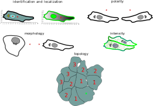

Type: Identification & Localization
-----------------------------------

Localization and identification features are used to identify and locate the object of interest in the image.
These features are essential for the subsequent analysis of the image data.

Type: Morphology
----------------

Morphological features characterize the shape and size of the object of interest.
These can be further classified into geometric features, which describe the object's overall shape; structural features,
which detail the internal structure; and ratio-based features,
which involve calculations of various proportions.

Type: Polarity
--------------

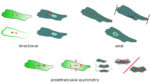

Polarity features characterize the orientation and asymmetry of the object
of interest. Broadly, these can be divided into directional features,
which describe the orientation of two objects relative to one another,
and axial features, which define the orientation of an object relative to
a reference axis. Additionally, predefined axial asymmetry features quantify
an object's asymmetry or the asymmetry of its intensity relative to a
reference axis by calculating proportions.

It is not straightforward to understand the difference of axial and directed polarity.
Directed polarity can have values between 0 and 360 degrees, while axial polarity is a value between 0 and 180 degrees.

See the following two illustrations to understand the difference:

.. rst-class:: center

    axial polarity (left) and directed polarity (right)

|cso| |ngo|

Type: Intensity
---------------

Intensity features characterize the object's intensity and expression levels.
The intensity within different regions can be summed, averaged, or compared using ratios or proportions.

Type: Topology
--------------

Topology features describe the spatial relationships between objects in an image. These features are useful for analyzing
the distribution of objects and their interactions within the image.
Specifically, we focus on the connectivity (neighborhood) and spatial
arrangement properties of the objects.

Targets
-------

We offer features for extracting various targets and their combinations.
The image below illustrates the different targets.

The following demonstrates how to extract features from a multichannel image for different targets and the required configuration.

+----------------------+------------------------+------------------------------------------------------+---------------------------------------------------------------------------------------------------------------------------------------------------------------------+
| Target               | _______Sketch_______   | Required configuration                               | Description                                                                                                                                                         |
+======================+========================+======================================================+=====================================================================================================================================================================+
| single cell          | |cell|                 | segmentation                                         | The general features extracted from the image.                                                                                                                      |
+----------------------+------------------------+------------------------------------------------------+---------------------------------------------------------------------------------------------------------------------------------------------------------------------+
| nucleus              | |nucleus|              | segmentation + nucleus channel                       | All features belonging to the nucleus of the cell.                                                                                                                  |
+----------------------+------------------------+------------------------------------------------------+---------------------------------------------------------------------------------------------------------------------------------------------------------------------+
| organelle            | |organelle|            | segmentation + organelle + nucleus channel           | All features belonging to the organelle of a cell.                                                                                                                  |
+----------------------+------------------------+------------------------------------------------------+---------------------------------------------------------------------------------------------------------------------------------------------------------------------+
| junction             | |junction|             | segmentation + junction channel                      | All features belonging to the junctions of a cell                                                                                                                   |
+----------------------+------------------------+------------------------------------------------------+---------------------------------------------------------------------------------------------------------------------------------------------------------------------+
| marker               | |marker|               | segmentation + expression marker channel             | All features belonging to the expression marker                                                                                                                     |
+----------------------+------------------------+------------------------------------------------------+---------------------------------------------------------------------------------------------------------------------------------------------------------------------+
| marker nucleus       | |marker_nuc|           |  segmentation + expression marker + nucleus channel  | All features belonging to the expression marker and nucleus                                                                                                         |
+----------------------+------------------------+------------------------------------------------------+---------------------------------------------------------------------------------------------------------------------------------------------------------------------+
| marker cytosol       | |marker_cyt|           | segmentation + expression marker + nucleus channel   | All features belonging to the expression marker and cell without nucleus                                                                                            |
+----------------------+------------------------+------------------------------------------------------+---------------------------------------------------------------------------------------------------------------------------------------------------------------------+
| cell neighborhood    | |cell_neighborhood|    | segmentation + FOI                                   | Statistical properties of a feature of interest (FOI). Includes neighborhood statistics. Default FOI is "area".                                                     |
+----------------------+------------------------+------------------------------------------------------+---------------------------------------------------------------------------------------------------------------------------------------------------------------------+
| group                | |group|                | segmentation + FOI                                   | Group properties. Image wise. Includes Morans I correlation analysis of the feature of interest (FOI). Default FOI is "area"                                        |
+----------------------+------------------------+------------------------------------------------------+---------------------------------------------------------------------------------------------------------------------------------------------------------------------+

.. note::
    When a segmentation is not provided during input it will be calculated.

Target: Single cell
-------------------
+----------------------------+----------------+-----------------------------+----------------------------------------------------------------------------------------------------------------------------------------+
| Feature Name               | Category       | _______Feature_______       | Description                                                                                                                            |
+============================+================+=============================+========================================================================================================================================+
| filename                   | None           |                             | The filename where the cell was found.                                                                                                 |
+----------------------------+----------------+-----------------------------+----------------------------------------------------------------------------------------------------------------------------------------+
| img_hash                   | None           |                             | The sha1 hexadecimal hash of the image content.                                                                                        |
+----------------------------+----------------+-----------------------------+----------------------------------------------------------------------------------------------------------------------------------------+
| label                      | identification | |cell_label|                | The cellpose segmentation label of the particular cell.                                                                                |
+----------------------------+----------------+-----------------------------+----------------------------------------------------------------------------------------------------------------------------------------+
| cell_X                     | localization   | |cell_centroid|             | The X coordinate (horizontal axis) of the center of the cell.                                                                          |
+----------------------------+----------------+-----------------------------+----------------------------------------------------------------------------------------------------------------------------------------+
| cell_Y                     | localization   | |cell_centroid|             | The Y coordinate (vertical axis) of the center of the cell.                                                                            |
+----------------------------+----------------+-----------------------------+----------------------------------------------------------------------------------------------------------------------------------------+
| cell_shape_orientation_deg | polarity       | |cell_shape_orientation|    | Long axis of ellipsoid fit of the cell in degree.                                                                                      |
+----------------------------+----------------+-----------------------------+----------------------------------------------------------------------------------------------------------------------------------------+
| cell_shape_orientation_rad | polarity       | |cell_shape_orientation|    | Long axis of ellipsoid fit of the cell in rad.                                                                                         |
+----------------------------+----------------+-----------------------------+----------------------------------------------------------------------------------------------------------------------------------------+
| cell_major_axis_length     | morphology     | |cell_major_axis_length|    | Length of the major axis of the cell.                                                                                                  |
+----------------------------+----------------+-----------------------------+----------------------------------------------------------------------------------------------------------------------------------------+
| cell_minor_axis_length     | morphology     | |cell_minor_axis_length|    | Length of the minor axis of the cell.                                                                                                  |
+----------------------------+----------------+-----------------------------+----------------------------------------------------------------------------------------------------------------------------------------+
| cell_eccentricity          | morphology     | |cell_eccentricity|         | Value for the elongation of the cell. Between 0 and 1, where 0 correspond to a perfect circular cell and 1 for a strongly elongated cel|
+----------------------------+----------------+-----------------------------+----------------------------------------------------------------------------------------------------------------------------------------+
| cell_major_to_minor_ratio  | morphology     | |cell_major_to_minor_ratio| | Ratio between the major and the minor axis of the cell.                                                                                |
+----------------------------+----------------+-----------------------------+----------------------------------------------------------------------------------------------------------------------------------------+
| cell_area                  | morphology     | |cell_area|                 | The area of the cell.                                                                                                                  |
+----------------------------+----------------+-----------------------------+----------------------------------------------------------------------------------------------------------------------------------------+
| cell_perimeter             | morphology     | |cell_perimeter|            | The perimeter of the cell.                                                                                                             |
+----------------------------+----------------+-----------------------------+----------------------------------------------------------------------------------------------------------------------------------------+
| cell_circularity           | morphology     | |cell_circularity|          | Cell shape circularity computed from 4*pi*(area/perimeter^2), also see https://imagej.net/ij/plugins/circularity.html .                |
+----------------------------+----------------+-----------------------------+----------------------------------------------------------------------------------------------------------------------------------------+
| cell_shape_index           | morphology     | |cell_shape_index|          | Cell shape index computed from cell_perimeter / np.sqrt(cell_area), see for example https://doi.org/10.1038/nphys3471 .                |
+----------------------------+----------------+-----------------------------+----------------------------------------------------------------------------------------------------------------------------------------+

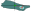

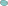

Target: Nucleus
---------------
+-----------------------------------+----------------+--------------------------------+----------------------------------------------------------------------------------------------------------------------------------------------------+
| Feature                           | Category       | _______Feature_______          | Description                                                                                                                                        |
+===================================+================+================================+====================================================================================================================================================+
| nuc_X                             | localization   | |nuc_centroid|                 | X position (horizontal axis) of the cell nucleus.                                                                                                  |
+-----------------------------------+----------------+--------------------------------+----------------------------------------------------------------------------------------------------------------------------------------------------+
| nuc_Y                             | localization   | |nuc_centroid|                 | Y position (vertical axis) of the cell nucleus.                                                                                                    |
+-----------------------------------+----------------+--------------------------------+----------------------------------------------------------------------------------------------------------------------------------------------------+
| nuc_displacement_orientation_rad  | polarity       | |nuc_displacement_orientation| | The displacement orientation of the nucleus from the center of the cell in rad.                                                                    |
+-----------------------------------+----------------+--------------------------------+----------------------------------------------------------------------------------------------------------------------------------------------------+
| nuc_displacement_orientation_deg  | polarity       | |nuc_displacement_orientation| | The displacement orientation of the nucleus from the center of the cell in deg.                                                                    |
+-----------------------------------+----------------+--------------------------------+----------------------------------------------------------------------------------------------------------------------------------------------------+
| nuc_shape_orientation_rad         | polarity       | |nuc_shape_orientation|        | Long axis of ellipsoid fit of the nucleus in rad.                                                                                                  |
+-----------------------------------+----------------+--------------------------------+----------------------------------------------------------------------------------------------------------------------------------------------------+
| nuc_shape_orientation_deg         | polarity       | |nuc_shape_orientation|        | Long axis of ellipsoid fit of the nucleus in deg.                                                                                                  |
+-----------------------------------+----------------+--------------------------------+----------------------------------------------------------------------------------------------------------------------------------------------------+
| nuc_major_axis_length             | morphology     | |nuc_major_axis_length|        | The length of the major axis of the nucleus.                                                                                                       |
+-----------------------------------+----------------+--------------------------------+----------------------------------------------------------------------------------------------------------------------------------------------------+
| nuc_minor_axis_length             | morphology     | |nuc_minor_axis_length|        | The length of the minor axis of the nucleus.                                                                                                       |
+-----------------------------------+----------------+--------------------------------+----------------------------------------------------------------------------------------------------------------------------------------------------+
| nuc_area                          | morphology     | |nuc_area|                     | The area of the nucleus.                                                                                                                           |
+-----------------------------------+----------------+--------------------------------+----------------------------------------------------------------------------------------------------------------------------------------------------+
| nuc_perimeter                     | morphology     | |nuc_perimeter|                | The perimeter of the nucleus.                                                                                                                      |
+-----------------------------------+----------------+--------------------------------+----------------------------------------------------------------------------------------------------------------------------------------------------+
| nuc_eccentricity                  | morphology     | |nuc_eccentricity|             | Value for the elongation of the nucleus. Between 0 and 1, where 0 correspond to a perfect circular nucleus and 1 for a strongly elongated nucleus. |
+-----------------------------------+----------------+--------------------------------+----------------------------------------------------------------------------------------------------------------------------------------------------+
| nuc_major_to_minor_ratio          | morphology     | |nuc_major_to_minor_ratio|     | Ratio between the major and the minor axis of the nucleus.                                                                                         |
+-----------------------------------+----------------+--------------------------------+----------------------------------------------------------------------------------------------------------------------------------------------------+
| nuc_circularity                   | morphology     | |nuc_circularity|              | Nucleus shape circularity computed from 4*pi*(area/perimeter^2), also see https://imagej.net/ij/plugins/circularity.html .                         |
+-----------------------------------+----------------+--------------------------------+----------------------------------------------------------------------------------------------------------------------------------------------------+
| nuc_shape_index                   | morphology     | |nuc_shape_index|              | Nucleus shape index computed from cell_perimeter / np.sqrt(cell_area).                                                                             |
+-----------------------------------+----------------+--------------------------------+----------------------------------------------------------------------------------------------------------------------------------------------------+

Target: Organelle
-----------------
+----------------------------+----------------+-----------------------------+--------------------------------------------------------------------------+
| Feature                    | Category       | _______Feature_______       | Explanation                                                              |
+============================+================+=============================+==========================================================================+
| organelle_X                | localization   | |organelle_centroid|        | The X coordinate (horizontal axis) of the center of the cell organelle.  |
+----------------------------+----------------+-----------------------------+--------------------------------------------------------------------------+
| organelle_Y                | localization   | |organelle_centroid|        | The Y coordinate (vertical axis) of the center of the cell organelle.    |
+----------------------------+----------------+-----------------------------+--------------------------------------------------------------------------+
| nuc_organelle_distance     | morphology     | |nuc_organelle_distance|    | Distance from cell organelle to the nucleus.                             |
+----------------------------+----------------+-----------------------------+--------------------------------------------------------------------------+
| organelle_orientation_rad  | polarity       | |organelle_orientation|     | The orientation in rad of the organelle to the nucleus                   |
+----------------------------+----------------+-----------------------------+--------------------------------------------------------------------------+
| organelle_orientation_deg  | polarity       | |organelle_orientation|     | The orientation in deg of the organelle to the nucleus                   |
+----------------------------+----------------+-----------------------------+--------------------------------------------------------------------------+

.. note::
    Here Golgi has been exemplary chosen as a organelle. The features are generic and can be applied to any organelle.

.. |marker_sum_expression| image:: images/features/marker_sum_expression.svg
    :width: 200px

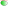

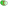

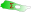

.. |marker_mean_expression_nuc_cyt_ratio| image:: images/features/marker_mean_expression_nuc_cyt_ratio.svg
    :width: 200px

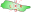

Target: Marker
--------------
+-----------------------------------------+----------------+----------------------------------------+--------------------------------------------------------------------------------------------------------------------------+
| Feature                                 | Category       | _______Feature_______                  | Explanation                                                                                                              |
+=========================================+================+========================================+==========================================================================================================================+
| marker_centroid_X                       | localization   | |marker_centroid|                      | The X coordinate (horizontal axis) of the center of the marker expression.                                               |
+-----------------------------------------+----------------+----------------------------------------+--------------------------------------------------------------------------------------------------------------------------+
| marker_centroid_Y                       | localization   | |marker_centroid|                      | The Y coordinate (vertical axis) of the center of the marker expression.                                                 |
+-----------------------------------------+----------------+----------------------------------------+--------------------------------------------------------------------------------------------------------------------------+
| marker_mean_expression                  | intensity      | |marker_mean_expression|               | Mean expression of the channel with the marker.                                                                          |
+-----------------------------------------+----------------+----------------------------------------+--------------------------------------------------------------------------------------------------------------------------+
| marker_sum_expression                   | intensity      | |marker_sum_expression|                | The absolute sum of the expression of the marker.                                                                        |
+-----------------------------------------+----------------+----------------------------------------+--------------------------------------------------------------------------------------------------------------------------+
| marker_centroid_orientation_rad         | polarity       | |marker_centroid_orientation|          | Intrinsic asymmetry of the cell.                                                                                         |
+-----------------------------------------+----------------+----------------------------------------+--------------------------------------------------------------------------------------------------------------------------+
| marker_centroid_orientation_deg         | polarity       | |marker_centroid_orientation|          | Intrinsic asymmetry of the cell.                                                                                         |
+-----------------------------------------+----------------+----------------------------------------+--------------------------------------------------------------------------------------------------------------------------+
| marker_mean_expression_mem              | intensity      | |marker_mean_expression_mem|           | Mean membrane expression.                                                                                                |
+-----------------------------------------+----------------+----------------------------------------+--------------------------------------------------------------------------------------------------------------------------+
| marker_sum_expression_mem               | intensity      | |marker_sum_expression_mem|            | The absolut sum of the membrane expression.                                                                              |
+-----------------------------------------+----------------+----------------------------------------+--------------------------------------------------------------------------------------------------------------------------+
| marker_mean_expression_nuc              | intensity      | |marker_mean_expression_nuc|           | The mean expression of the nucleus.                                                                                      |
+-----------------------------------------+----------------+----------------------------------------+--------------------------------------------------------------------------------------------------------------------------+
| marker_sum_expression_nuc               | intensity      | |marker_sum_expression_nuc|            | The absolut sum of the nucleus expression.                                                                               |
+-----------------------------------------+----------------+----------------------------------------+--------------------------------------------------------------------------------------------------------------------------+
| marker_mean_expression_cyt              | intensity      | |marker_mean_expression_cyt|           | The mean expression of the cell cytosol.                                                                                 |
+-----------------------------------------+----------------+----------------------------------------+--------------------------------------------------------------------------------------------------------------------------+
| marker_sum_expression_cyt               | intensity      | |marker_sum_expression_cyt|            | The absolut sum of the cell cytosol expression.                                                                          |
+-----------------------------------------+----------------+----------------------------------------+--------------------------------------------------------------------------------------------------------------------------+
| marker_nucleus_orientation_rad          | polarity       | |marker_nucleus_orientation|           | The orientation in rad of the marker centroid to the nucleus.                                                            |
+-----------------------------------------+----------------+----------------------------------------+--------------------------------------------------------------------------------------------------------------------------+
| marker_nucleus_orientation_deg          | polarity       | |marker_nucleus_orientation|           | The orientation in rad of the marker centroid to the nucleus.                                                            |
+-----------------------------------------+----------------+----------------------------------------+--------------------------------------------------------------------------------------------------------------------------+
| marker_mean_expression_nuc_cyt_ratio    | intensity      | |marker_mean_expression_nuc_cyt_ratio| | The ratio between the mean marker expression in the region of the nucleus and the mean marker expression in the cytosol. |
+-----------------------------------------+----------------+----------------------------------------+--------------------------------------------------------------------------------------------------------------------------+
| marker_cue_directional_intensity_ratio  | polarity       | |marker_cue_intensity_ratio|           | The ratio of the left vs right cell membrane intensity in cue direction.                                                 |
+-----------------------------------------+----------------+----------------------------------------+--------------------------------------------------------------------------------------------------------------------------+
| marker_cue_axial_intensity_ratio        | polarity       | |marker_axial_cue_intensity_ratio|     | The ratio of the sum of cell membrane quarters in cue direction and the total membrane intensity.                        |
+-----------------------------------------+----------------+----------------------------------------+--------------------------------------------------------------------------------------------------------------------------+

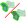

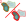

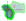

Target: Junction
----------------

+----------------------------------------+----------------------+------------------------------------------+---------------------------------------------------------------------------------------------------+
| Feature                                | Category             | _______Feature_______                    | Explanation                                                                                       |
+========================================+======================+==========================================+===================================================================================================+
| junction_centroid_X                    | localization         | |junction_centroid|                      | The X coordinate (horizontal axis) of the center of the junction expression.                      |
+----------------------------------------+----------------------+------------------------------------------+---------------------------------------------------------------------------------------------------+
| junction_centroid_Y                    | localization         | |junction_centroid|                      | The Y coordinate (vertical axis) of the center of the junction expression.                        |
+----------------------------------------+----------------------+------------------------------------------+---------------------------------------------------------------------------------------------------+
| junction_perimeter                     | morphology           | |junction_perimeter|                     | The perimeter of the junction area.                                                               |
+----------------------------------------+----------------------+------------------------------------------+---------------------------------------------------------------------------------------------------+
| junction_protein_area                  | morphology           | |junction_protein_area|                  | The area with junction protein expression.                                                        |
+----------------------------------------+----------------------+------------------------------------------+---------------------------------------------------------------------------------------------------+
| junction_mean_intensity                | intensity            | |junction_mean_intensity|                | The mean junction intensity value.                                                                |
+----------------------------------------+----------------------+------------------------------------------+---------------------------------------------------------------------------------------------------+
| junction_protein_intensity             | intensity            | |junction_protein_intensity|             | The mean protein intensity by area.                                                               |
+----------------------------------------+----------------------+------------------------------------------+---------------------------------------------------------------------------------------------------+
| junction_interface_linearity_index     | morphology           | |junction_interface_linearity_index|     | The linearity index of the junction.                                                              |
+----------------------------------------+----------------------+------------------------------------------+---------------------------------------------------------------------------------------------------+
| junction_interface_occupancy           | morphology           | |junction_interface_occupancy|           | The  ratio between junction area and junction protein area.                                       |
+----------------------------------------+----------------------+------------------------------------------+---------------------------------------------------------------------------------------------------+
| junction_intensity_per_interface_area  | morphology\intensity | |junction_intensity_per_interface_area|  | The ratio between the junction protein intensity and the junction area.                           |
+----------------------------------------+----------------------+------------------------------------------+---------------------------------------------------------------------------------------------------+
| junction_cluster_density               | morphology\intensity | |junction_cluster_density|               | The ratio between the junction protein intensity and the junction protein area                    |
+----------------------------------------+----------------------+------------------------------------------+---------------------------------------------------------------------------------------------------+
| junction_centroid_orientation_rad      | polarity°            | |junction_centroid_orientation|          | The orientation in rad of the junction intensity area centroid to the center of the cell.         |
+----------------------------------------+----------------------+------------------------------------------+---------------------------------------------------------------------------------------------------+
| junction_centroid_orientation_deg      | polarity°            | |junction_centroid_orientation|          | The orientation in deg of the junction intensity area centroid to the center of the cell.         |
+----------------------------------------+----------------------+------------------------------------------+---------------------------------------------------------------------------------------------------+
| junction_cue_intensity_ratio           | polarity°            | |junction_cue_intensity_ratio|           | The ratio of the left vs right cell membrane intensity in cue direction.                          |
+----------------------------------------+----------------------+------------------------------------------+---------------------------------------------------------------------------------------------------+
| junction_cue_axial_intensity_ratio     | polarity°            | |junction_axial_cue_intensity_ratio|     | The ratio of the sum of cell membrane quarters in cue direction and the total membrane intensity. |
+----------------------------------------+----------------------+------------------------------------------+---------------------------------------------------------------------------------------------------+

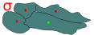

Target: Topology - neighborhood
-------------------------------
+---------------------------+----------------+-----------------------------+-------------------------------------------------------------------------------------------+
| Feature                   | Category       | _______Feature_______       | Explanation                                                                               |
+===========================+================+=============================+===========================================================================================+
| neighbors_cell            | topology       | |neighbors_cell|            | The absolut number of neighbors of the cell.                                              |
+---------------------------+----------------+-----------------------------+-------------------------------------------------------------------------------------------+
| neighbors_mean_dif_1st    | topology       |  |neighbors_mean_dif_1st|   | Mean difference of the feature of interest to all first neighbors.                        |
+---------------------------+----------------+-----------------------------+-------------------------------------------------------------------------------------------+
| neighbors_median_dif_1st  | topology       |  |neighbors_median_dif_1st| | Median difference of the feature of interest to all first neighbors.                      |
+---------------------------+----------------+-----------------------------+-------------------------------------------------------------------------------------------+
| neighbors_stddev_dif_1st  | topology       |  |neighbors_stddev_dif_1st| | Standard derivation of the difference of the feature of interest to all first neighbors.  |
+---------------------------+----------------+-----------------------------+-------------------------------------------------------------------------------------------+
| neighbors_range_dif_1st   | topology       |  |neighbors_range_dif_1st|  | Maximal range of difference of the feature of interest to all first neighbors.            |
+---------------------------+----------------+-----------------------------+-------------------------------------------------------------------------------------------+
| neighbors_mean_dif_2nd    | topology       |  |neighbors_mean_dif_2nd|   | Mean difference of the feature of interest to all second neighbors.                       |
+---------------------------+----------------+-----------------------------+-------------------------------------------------------------------------------------------+
| neighbors_median_dif_2nd  | topology       |  |neighbors_median_dif_2nd| | Median difference of the feature of interest to all second neighbors.                     |
+---------------------------+----------------+-----------------------------+-------------------------------------------------------------------------------------------+
| neighbors_stddev_dif_2nd  | topology       |  |neighbors_stddev_dif_2nd| | Standard derivation of the difference of the feature of interest to all second neighbors. |
+---------------------------+----------------+-----------------------------+-------------------------------------------------------------------------------------------+
| neighbors_range_dif_2nd   | topology       |  |neighbors_range_dif_2nd|  | Maximal range of difference of the feature of interest to all second neighbors.           |
+---------------------------+----------------+-----------------------------+-------------------------------------------------------------------------------------------+

Target: Topology - group
------------------------

+----------------+----------------+-----------------------------+--------------------------------------+
| Feature        | Category       | _______Feature_______       | Explanation                          |
+================+================+=============================+======================================+
| morans_i       | topology       | |group_morans_i|            | Statistical correlation analysis     |
+----------------+----------------+-----------------------------+--------------------------------------+
| morans_p_norm  | topology       | |group_morans_p_norm|       | P-norm of the correlation analysis.  |
+----------------+----------------+-----------------------------+--------------------------------------+

