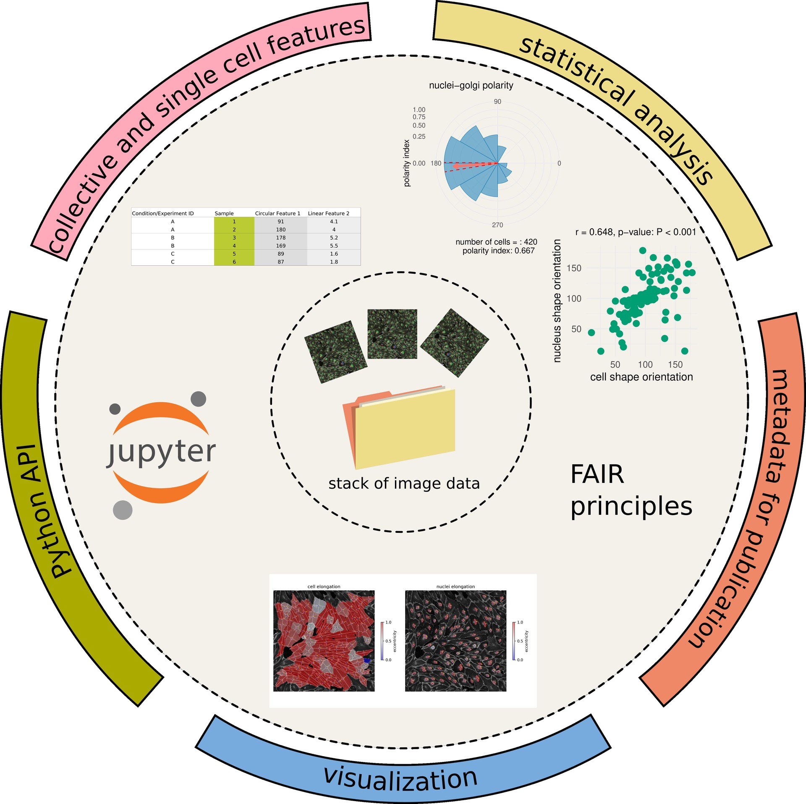

.. _software suite:

What is PolarityJaM?
====================

PolarityJaM suite
-----------------

The `PolarityJaM <https://www.nature.com/articles/s41467-025-56643-x>`_ suite is a software package that lets you study cell polarity, junctions and morphology.

At the heart lies your data that you wish to explore. That usually involves three steps:

(1) extracting relevant features from your data,
(2) analyzing the features and
(3) visualizing the results.

Moreover, you want your work to be reproducible, easily comprehensible and eventually extendable by others.
PolarityJaM is designed to help you with all of these tasks!

The analysis of images performed by PolarityJaM is divided into two individual processing parts which
can be executed independently. Firstly, all necessary information from the input is
extracted via a feature extraction pipeline. The output will be a ``.csv`` file that can be easily
shared and interpreted. Secondly, in an independent step these features can be statistically
analysed in the web-app and interesting patterns can be revealed. Typically, gaining insights
into data requires a significant investment of time and domain knowledge.
To minimize the amount of time needed to quickly look at complex cell patterns and potentially
discover interesting collective behavior, visualizing the features can be done interactively in an
online setting. Simply visit `www.polarityjam.com <http://www.polarityjam.com>`_ to experience what is possible,
without the need to execute anything.

Feature Extraction Pipeline
---------------------------
The feature extraction pipeline lets you extract relevant features from your image(s) and collect
them in a ``.csv`` file. Optionally, the user can choose between several options to visualize the input
images(s) and have a first look at the result from the information extraction process. To know
what features can be extracted, visit the :ref:`usage` section.
To know more about the features, visualizations and methodology behind
this process check out the :ref:`methods` section.

Often, an analysis performed is barely reproducible due to missing information about version,
specific parameters and more. PolarityJaM feature extraction pipeline additionally stores all necessary
meta-information to facilitate the reproduction of the extraction process at a later point in time.
This includes both, the full log output of the extraction process, as well as the specific parameters
the pipeline was started with. This allows to perform several analyses on different data and continue
or repeat previous feature extraction processes without spending much effort into organizing the meta
information. Additionally, the informative logging system supports you with information about the
current process.

Online Service
--------------

Once the feature extraction process is finished, the information can be statistically analysed to
discover structural patterns. Easiest way to achieve this is to use our service, hosted at
`www.polarityjam.com <http://www.polarityjam.com>`_, by simply uploading the ``.csv`` file from the feature
extraction process. Alternatively, the app can be executed locally.

Security
--------

We take security of our service very seriously! Data might stem from sensitive experiments and should treated
with care. Therefore, we do not store any data on our servers. All uploaded data is deleted once
the user closes the browser tab. Of course it is not sent to any third party during the statistical analysis.
